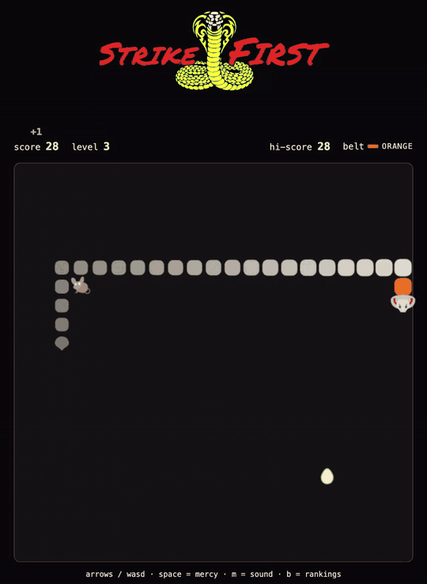

# Strike First

**Snake, as a dojo.** Free in your browser, nothing to install.

### [▶ Play it now](https://karinnielsen.github.io/strike-first/)

## Features

- **The Snake you know.** Same rules, same controls.
- **Three foods,** each a decision rather than a free lunch.
- **Belts.** Real Tang Soo Do ranks, earned by beating your best. Promotion
  can land mid-run.
- **Dojos.** Fight for Cobra Kai, Miyagi-Do or Eagle Fang. Every run counts
  for you and your dojo on the All Valley Rankings.
- **Challenge a friend** with a link that says who they are up against. The
  score to beat sits in the stats for the whole run, struck out the moment
  you pass it. Their score lands on the same board.
- **Sound.** Arcade effects, and an original soundtrack that stays off until
  you ask for it.
- **Keyboard or tablet.** Swipe to steer on a touch screen. Phones get a page
  that sends the link to a bigger screen.

## Controls

| | Keyboard | Touch |
| --- | --- | --- |
| Move | arrows or WASD | swipe |
| Mercy (pause) | Space or Esc | ❚❚ |
| Rematch | R | tap Rematch |
| Sound | M | speaker |
| Rankings | B | menu |
| Back | Esc | ← |
| Feedback | F | speech bubble |

## Food

| | Points | Length | Stays |
| --- | --- | --- | --- |
| 🥚 Egg | +1 | +1 | always one on the board |
| 🐁 Mouse | +5 | +2 | long enough to reach it, if you go now |
| 🤢 Rotten egg | −3 | none, but you're queasy for 14 moves | 45 moves |

Rotten eggs land where dodging them costs you something, and get harsher as a
run goes on.

A mouse or a rotten egg blinks once a move before it leaves. While you can
see it, you can still reach it.

## Belts

Your rank comes from your best score ever, so only a real breakthrough
promotes you.

| Belt | Best score |
| --- | --- |
| White | 0 |
| Orange | 15 |
| Green | 35 |
| Brown | 65 |
| Red | 110 |
| Cho Dan Bo (blue) | 175 |
| Midnight blue | 275 |

The top belt is midnight blue, not black: black symbolises an end, and
learning never stops.

## Stack

- **Client:** vanilla JS + Canvas 2D in a single `index.html`. No framework, no build step.
- **Backend:** Supabase (Postgres + REST, row-level security).
- **Built with:** [Claude Code](https://claude.com/claude-code).
- **Assets:** Astra (art, soundtrack), Cyanite (music analysis).

## Contribute

PRs welcome — start with an
[open starter issue](https://github.com/karinnielsen/strike-first/labels/good%20first%20issue).
Local copies write to a sandbox, not the live board.

Current version: **v1.0.11** — see [CHANGELOG.md](CHANGELOG.md).

## Credits and licence

An unofficial, non-commercial fan homage to *The Karate Kid* and *Cobra Kai*,
not affiliated with or endorsed by their owners. Code under the
[MIT licence](LICENSE).
