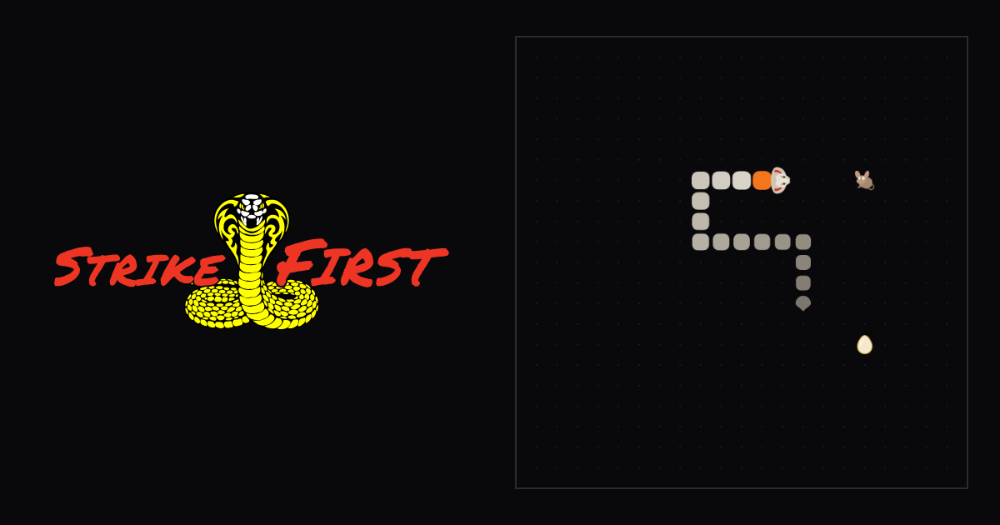

# Strike First

Snake, as a dojo. Eat eggs, chase mice, dodge rotten ones and earn your belt.

**[Play it in your browser →](https://karinnielsen.github.io/strike-first/)**

[](https://karinnielsen.github.io/strike-first/)

One HTML file of code, no build step and nothing to install — open it and play.
Beside it sit a few images: the dojo crests and the sharing preview. Its one
outside connection is a hosted database for scores. Made for desktop and tablet.
A phone gets a landing page instead of the game, with a way to send the link to
a bigger screen.

Current version: **v0.5.13** — see [CHANGELOG.md](CHANGELOG.md).

## Play

- **Arrow keys** or **WASD** to move
- **Space** or **Esc** to pause — the game calls it mercy. Continuing bows
  you back in, so you have a moment to find the snake again
- **R** for a rematch, once you have lost. There is no restart mid-run: the way
  out of a run is mercy, then **Quit**
- **M** for sound, on any screen — the title included, where it works without
  starting the game. It steps through three states: effects only, then effects
  and music, then silence. Music is off until you ask for it, and never plays
  during a run
- **B** between runs for the All Valley Rankings
- **Esc** to go back, on every screen you can leave: dojo select, the
  rankings and the verdict, where it does what **Main menu** does

Every menu works the same way: **↑ ↓**, **W S** or **Tab** to move, **Enter**
or **Space** to choose, or point and click.

In the top-right corner of every screen, for mouse or finger: the **speaker**
steps through the same three states as **M** — one wave for effects, two for
effects and music, crossed out for silence — and **❚❚** calls mercy during a run. Its mirror in the
top-left, the **back arrow**, is there on every screen **Esc** leaves. There is
none on the title, which has nowhere to go back to, and none in a run, whose
way out is mercy.

On a tablet or any touch screen:

- **Swipe on the board** to turn. The turn happens as your finger moves, and
  right-then-up in one unbroken stroke rounds a corner
- **The ❚❚ button** in the top-right corner for mercy, beside the speaker for
  sound
- Tap a menu row to choose it

The board is 21×21 squares, drawn at 30px a square. The grid is the game; the
cell size is only how large it is drawn.

The whole board fits on screen on an iPad in either orientation and in
ordinary laptop and desktop windows. In a tall window the crest, scores and
board stack. In a short or landscape one — a landscape iPad, a laptop, a
1080p browser — the crest sits on top and the scores become a list beside the
board. When there isn't room for the board at full size, the crest shrinks
first and then the board, but never below 20px a square.

## What's in it

### Three foods, three roles

Never more than two things on the board at once — the egg, plus at most one
visitor. That keeps every decision binary, which is the most anyone can answer
at seventy milliseconds a move.

| | Worth | Costs you | Sticks around |
| --- | --- | --- | --- |
| **Egg** | 1 | 1 length | always exactly one, never expires |
| **Mouse** | 5 | **2 length** | a clock set by how far away it is |
| **Rotten egg** | **−3** | leaves you queasy for 14 moves | 45 of your moves |

Roughly two eggs in five bring a visitor along, and about two in five of those
are rotten. Visitors flash when they are about to leave.

A rotten egg lands **where dodging it costs you something**, and it gets harsher
as a run goes on:

- **Not straight away.** No rotten egg until you've eaten 3 eggs or mice since
  the last one left, or since the run began. After that the usual odds apply,
  so the gaps stay random.
- **In the way.** Usually it sits on a shortest route between your head and the
  egg.
- **Beside the egg, near a belt.** In the last 5 points before a belt score it
  sits right beside the egg, on your side, so taking the egg means going around
  it. The first egg in that stretch always brings one, once per belt. That
  counts the belt scores themselves, whatever your best is, so it happens in
  Practice too.
- **It goes with its egg.** Eat the egg a rotten egg was guarding and the rotten
  egg blinks out over the next 6 moves. It can still be eaten while it goes.

It never lands within 3 squares of your head, and never boxes the egg in.

The mouse costing two squares rather than one is the point of it. A reward that
is strictly better with no cost isn't a decision — you take it every time and
nothing about how you play changes. Five points for two squares is a real
question late in a run.

A mouse lands **in a tight spot** — hard against a wall, in a corner, or fenced
in by your own body — so going for one means committing to a square you may not
get back out of. It never sits in a dead end with only one way in, and never
within 8 squares of your head: one at your feet would be a gift rather than a
choice.

And it is a **race**. A mouse doesn't get a fixed lifetime; its clock is set
from how far away it actually is, so every mouse asks the same question wherever
it lands — can you find the direct route and commit to it now? You are always
given enough moves to reach it, so missing one is a decision that went wrong
rather than bad luck. What you can't afford is to dither on the way.

A rotten egg deliberately costs you no length. Taking length *off* would be a
relief late in a run, which is the opposite of a punishment.

### Levels, and belts

These are different things and they live in different places.

- A **level** is difficulty within a run. Nine tiers, from an unhurried 260ms a
  move down to a 70ms floor, shown in the header. It resets when you die.
- A **belt** is a rank you hold across runs, shown on the snake as a single
  band and named in the header. It comes from your **best score ever**, so you
  are promoted only by beating your own record by enough to cross a threshold.

Seven ranks, following the real Tang Soo Do ladder: white, orange, green,
brown, red, Cho Dan Bo blue, then **midnight blue** rather than black — black
symbolises an end, and the idea is that learning never stops.

Promotion can land mid-run, while you are still trying not to die. It is rare
by design and it is the best moment the game has.

### Score feedback

A small `+1` for an egg, a big electric-yellow `+5` for a mouse. The size
difference is the message: you see the value before you read it. A loss is
red and always carries its minus sign, so it never relies on colour alone.

### The title screen

The game opens the way an arcade cabinet does: the crest, large and alone,
a blinking **Press start**, and along the foot, who made it and *free play*.
Any key, click or tap presses start, and does nothing else, so Space here
never also starts a run. A touch screen is told to tap rather than press a
key. It shows every time the page loads. With reduced motion it holds still
instead of blinking.

Pressing start puts the menu in its place, under the crest:

- **Arcade** is the real game, and the only one whose runs count: choose your
  dojo, then fight
- **Practice** goes straight into a run and keeps nothing — no rankings, no
  hi-score, no belt
- **Rankings** opens the All Valley Rankings without playing

Arcade is lit every time the menu opens. The lit row blinks its marker, and
with reduced motion it holds still.

### Dojo select

Every Arcade run counts for a dojo, so choosing Arcade opens the select:
**Cobra Kai**, **Miyagi-Do** or **Eagle Fang**, each a card with its crest. It
is an arcade select screen, so there are 30 seconds on the clock, and when it
runs out the lit dojo is chosen for you. The first time, the highlight starts on a
random dojo, so no dojo is everyone's default; after that it starts on yours.

- **← →** or **Tab** to choose, **Enter** or **Space** to bow in
- **↑ ↓** to flip a card. The back shows where the dojo stands, its team score,
  its students, its top student and its sensei. On a touch screen, tap a card
  to choose it and tap its turned-down corner to flip it
- **Esc** or the back arrow to leave without choosing. The clock stops, and
  the title comes back with Arcade lit

Choosing lands like a kick on the card, and the fight begins straight away.
If the clock runs out, Sensei chooses for you. The select opens every time you choose Arcade — choosing your
side is part of the ritual — but a **Rematch** skips it.

### The bow

Every run opens with a bow, the way every lost one closes with one. The snake
dips its head, draws back, and its first step is a strike. Half a second, and
the snake does not move until it is over, so it never eats into your reaction
time. Press a direction during it and that is your first move, straight away.

Continuing from mercy bows too, because the board has been covered and you
need a moment to find the snake. The bow is the same length at every level,
since the faster the game, the more you need it. A direction cuts it short
here as well, but never to less than one step. With reduced motion the head
holds still for the same half second instead of bowing.

### Defeat

About a second on the board before the verdict. The moment of impact holds
still so you can see the mistake, the snake is knocked back off whatever it
hit, the colour drains out of it from the tail up, and it bows its head. Then
a line in the dojo's voice, picked for how you died: the wall, your own tail,
scoring nothing, a new hi-score, or falling a few points short of your
hi-score or the next belt. The same line never comes up twice in a row.

Space, **R** or a tap skips it once the first moment has passed, so the key you
were hammering when you died does not restart the game by accident. Reduced
motion keeps the flash and the drain, and nothing moves.

Under the verdict is a menu that sits in the same place on every defeat:
**Rematch**, **Rankings** and **Main menu**, with **Challenge a friend** second
once you have signed a run. After a Practice run it is
**Practice**, **Arcade** and **Main menu** instead — the title's own menu — with no signing and no board.

**Quit** from mercy is a forfeit, and it counts. The heading reads
**FORFEIT**, and everything else goes as it would after a defeat. A run
quit with nothing scored has nothing to record, and goes straight back to
the title.

After a new hi-score in Arcade, the defeat screen asks you to **sign the
board** with three letters, the way an arcade cabinet did. The first time
they read **AAA**, after that last time's initials, so signing again is
Enter or a single tap on **Sign**, and typing over them starts afresh. The
next empty slot blinks yellow. There is no skip, as there never was on a
cabinet. **Sign** with fewer than three letters buzzes. A short list of rude
initials is refused, in the page and in the database, with a note under the
letters. On a tablet, tap the letters to bring up the keyboard. Signing saves
the run to a shared leaderboard. If the save fails, the menu comes up anyway,
and the board shows without your row.

The database only takes runs the game could have produced. A run's score,
length, moves and time are tied together by the rules, so a score typed in
by hand is refused, while every run actually played is accepted, however
good. Scores are also rate limited, so nobody can flood the board. A run
pumped up in the page itself is **DISQUALIFIED** instead of defeated, the
way a referee calls *shil kyuk*: the bout does not count, the score goes to
nothing and the hi-score it set is taken back.

### The board

The defeat screen shows the leaderboard whenever there is nothing to sign, and
once you have signed. It is a podium: the top three, then the run
above yours, yours in yellow, and the run below. If you are fifth or higher it
is just the top five. The columns are named along the top — rank, name, dojo,
belt, score — the same five as the full rankings, so the badge and the belt bar
are never unexplained. Your run is the one you just signed, or your last signed
run if this one wasn't a hi-score.

Every score counts for you and for your dojo. A run counts for the dojo you
were in when you signed it, even if you change later.

When the board is drawn small, the runs either side of yours are left out
rather than squeezing the rest. If the leaderboard can't be reached, there is
no board, and nothing else waits for it.

### Challenge a friend

Once you have signed the board, the defeat screen offers **Challenge a
friend**. On a tablet it opens the share sheet; on a computer it copies a link
and the row reads **Link copied** for a moment. The link points at your last
signed run, which is always your hi-score.

Whoever opens it sees, under the crest: *KAR of Cobra Kai challenges you to
Snake. Score to beat: 47.* The number is read from the board, not the link,
so a link can't be edited into a better score. After each of their Arcade runs
the verdict says whether they beat it, and their run lands on the same board,
which is how you find out. Practice can't settle it, since Practice keeps
nothing: beat the score there and the verdict says so, and that it does not
count. The challenge stays for the whole visit, so Arcade after Practice is
still measured against it. A link to a run the board no longer has simply
opens the game.

On a phone, the link opens a landing page instead: the crest, the challenge,
and **Send it to myself**, which opens the share sheet so it can be played on
a computer or tablet.

A link made from a copy running on your own machine points at that copy, and
its sandbox board.

### All Valley Rankings

The whole board, on a screen of its own. Open it from the title's menu or the defeat
screen's, or with **B** — never during a run, and not while you are signing. **Esc**, **B** or the back arrow returns you to where you were.

It is the top ten, then a gap and your run with the ones either side of it if
you are further down. The columns are named along the top — rank, name,
dojo, belt, score — and the top three places are picked out in bone.

Choose **All**, **Cobra Kai**, **Miyagi-Do** or **Eagle Fang** along the top
with **← →** or **Tab**, or by tapping. Filtered to a dojo, the places count
within that dojo, so its best run is 1st, and the dojo's crest sits above the
list. Each dojo's team score is on the back of its card in dojo select. On All each row carries its dojo's badge; filtered, the badge is left off,
because every row would repeat it.

It scrolls like a page, so on a tablet a swipe scrolls the rankings and never
steers a snake behind them.

### Sound

80s/90s arcade sound, generated in the page from square and pulse waves rather
than shipped as audio files. A blip for an egg, a squeak and a ding for a
mouse, a burp for a rotten egg, a quick run of chords for a promotion, a
long fall for defeat, and a blip and a chord as you move through a menu and
choose. Dojo select has its own: the same blip as you move between cards, a
soft whoosh as one turns over, and a thwack as your pick lands. All of it is in the key of
the music. A promotion replaces the sound of the food that earned
it. Nothing plays until you press start.

Music is a separate thing, and it is **off until you ask for it** — a game
that starts singing at someone on a train is the thing this avoids. It plays
on the start menu, dojo select and the rankings, and nowhere else: not in a
run, not at defeat. One quiet theme, and it fades rather than cuts.

**M** and the speaker step through effects only, effects and music, then
silence. Point at the speaker and it says which, in words: music off, music
on, or sound off. The game remembers the choice, and a tab you are not
looking at stops singing.

### The crest

Between runs the cobra in the crest flicks its tongue, the way a real snake
smells the air: in pairs, at uneven pauses. It holds still while you play, so
the only thing moving above the board is something worth looking at. Reduced
motion turns it off.

The snake on the board does its own flicking, every 6 to 20 of **your moves**
rather than on a clock, so the rhythm is the same whether you are thinking your
way through level 1 or flat out at level 9. Each flick is a whip: out fast,
back slower, twice. It keeps flicking whenever there is an egg or a mouse
directly ahead — it can smell it — and the whole time you are queasy. Not for
a rotten egg. It doesn't want that one. With reduced motion the tongue just
shows, without the whip.

During a run the board is drawn every frame, not only when the snake moves, so
the egg's pulse and a visitor's warning flash are smooth at every level.

## Next

Each is a milestone, and each ships as a version.

- **Dojo recruitment** — a challenge link that points at your place on the board
- **Choose your fighter** — pick a character
- **Forbidden techniques** — secrets, and modes you earn rather than pick
- **Sekai Taikai** — the world stage: accounts behind the initials, and one day
  multiplayer

## How it's made

Strike First is a first game, started on 7 September 2026 to learn how games
are actually built — loops, state, input, timing, balance — and built with
[Claude Code](https://claude.com/claude-code). The process is part of the
work, so it is all in the repo:

- **The commit history** says why each change was made, not only what changed,
  including the one that was reverted
- **[`CLAUDE.md`](CLAUDE.md)** holds the working agreements and the design
  principles the game is held to — among them, *a reward only matters if it
  can be refused*
- **[`design/`](design/)** keeps the specs, the tooling used to judge how it
  looks, and the options that lost, beside notes on why they lost

### Tuning

All the balance lives in named constants in section 2 of the script. Change
those rather than scattering numbers through the code.

| Constant | What it does |
| --- | --- |
| `LEVELS` | the nine speed tiers, as `{ from: score, ms: delay }` |
| `BELTS` | the seven ranks and the best score each one needs |
| `EGG_POINTS` / `MOUSE_POINTS` / `ROTTEN_POINTS` | what each food is worth |
| `EGG_GROWTH` / `MOUSE_GROWTH` | how much length each one costs you |
| `VISITOR_CHANCE` | odds that an egg brings a visitor along |
| `ROTTEN_SHARE` | how many of those visitors are rotten |
| `ROTTEN_COOLDOWN` | eggs or mice eaten before another rotten egg may come |
| `BELT_STRETCH` | points before a belt score where a rotten egg lands beside the egg |
| `ROTTEN_GAP` | how close to your head a rotten egg may land |
| `MOUSE_LIFE` / `ROTTEN_LIFE` | how many of *your moves* each one stays for |
| `WARNING_MOVES` | moves left when a visitor starts flashing |
| `REACH_BUDGET` | how far a visitor may spawn, as a fraction of its life |
| `QUEASY_MOVES` | how long the snake looks ill after a rotten egg |

Everything that could have been a timer counts **your moves** instead. Seconds
would make a mouse trivial at high speed and brutal at low speed; counting
moves keeps "can I reach it?" the same question all game, and stops anything
expiring while the game is paused.

### Tests

```bash
node test.js
```

No framework and nothing to install, same as the game. The harness reads
`index.html`, pulls the inline script out and runs it against a stubbed
browser, so the game stays a single file with nothing to install.

201 tests, covering the grid, the speed curve, collisions, growth, scoring, the
visitor countdown, the input rules for keys and swipes, how a run becomes a
score record, and the initials entry, including a check that the page and
the database refuse the same initials and hold the same limits on a run.
A bot plays the game's own loop, including the luckiest run the rules allow,
to check that no real run is ever refused. None of them touch the network. They cannot tell you
whether the game is *fun* — that still needs playing.

Needs Node 15 or newer.

### Running it locally

Open `index.html` in a browser, or serve the folder:

```bash
python3 -m http.server 8765
```

**Scores go to a sandbox database, not the real board.** Until v1.0.0 that is
true everywhere, the published link included — the real board is empty and is
being kept that way, so the first thing anyone sees on it is scores players
made rather than ours. The version line says **sandbox scores** whenever that
is what you are looking at.

After launch, the page chooses by where it is served from: localhost, a
`file://` open, or a private network address — which is how a tablet on your
own wi-fi arrives — keep using the sandbox, and only the published site keeps
real scores. So you can always play, sign a run and watch the rankings fill
without touching what everyone else sees.

### Versioning

The version lives in four places and they move together:

1. the `VERSION` constant at the top of the script in `index.html`,
   which renders in the footer
2. a new entry in `CHANGELOG.md`
3. the **Current version** line at the top of this file
4. an annotated git tag, e.g. `git tag -a v0.3.1 -m "..."`

A test fails if the first three disagree.

Read the numbers in game terms:

- **major** — the game plays differently enough to be a new thing
- **minor** — a new mechanic or mode, or a new step in the player's journey:
  a screen they pass through, or a choice every player makes
- **patch** — balance tuning, art, copy and bug fixes within the screens that
  already exist

**Artwork is a patch, however much of it there is.** v0.3.1 replaced the
wordmark with a drawn crest, moved the whole palette and made the board
artwork legible, and it was still a patch, because it added no step to the
journey and nothing played differently afterwards.

### Files

- `index.html` — the entire game, in ten commented sections
- `db/scores.sql` — the scores table and the rules that stop the page's public
  key doing anything but submitting and reading scores, and refusing runs no
  game could produce. The record of what the
  database looks like: change it here, then run the change in Supabase
- `favicon.svg`, `apple-touch-icon.png`, `og-image.png` — the tab icon, the
  home-screen icon and the link preview. Not part of the game: it plays
  without them. The PNGs are rendered from the game by
  `design/share/card.html`, so rebuild them there when the board or crest
  changes
- `test.js` — the test harness and the tests
- `CHANGELOG.md` — every version, and what changed for the player
- `CLAUDE.md` — how to work on the project
- `design/` — specs, tooling and decision records; see its
  [README](design/README.md)

## Credits and licence

An unofficial, non-commercial fan homage to *The Karate Kid* and *Cobra Kai*.
It is not affiliated with or endorsed by their owners, and those names and
characters belong to them.

The code is released under the [MIT licence](LICENSE).
