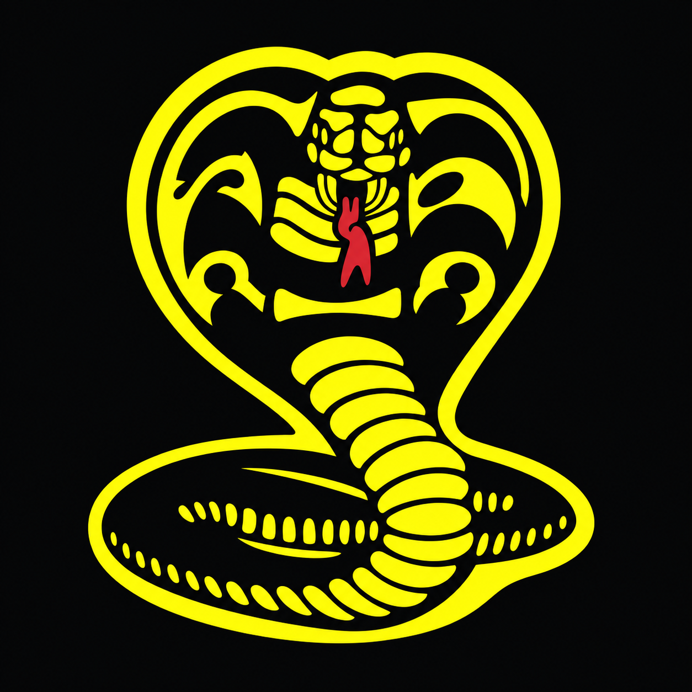
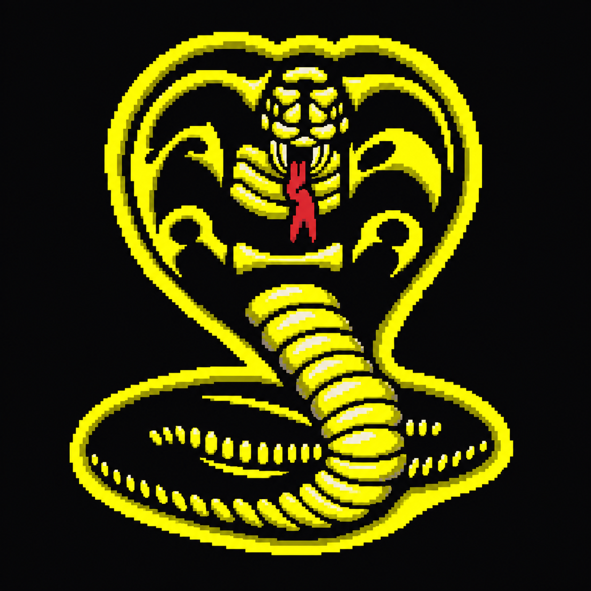
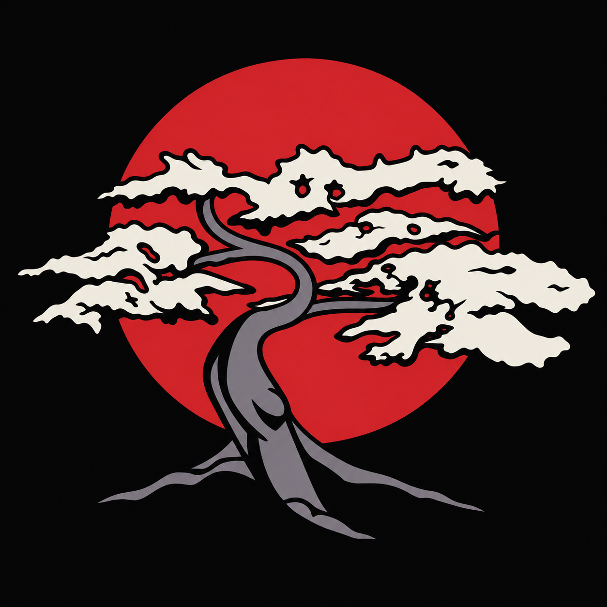
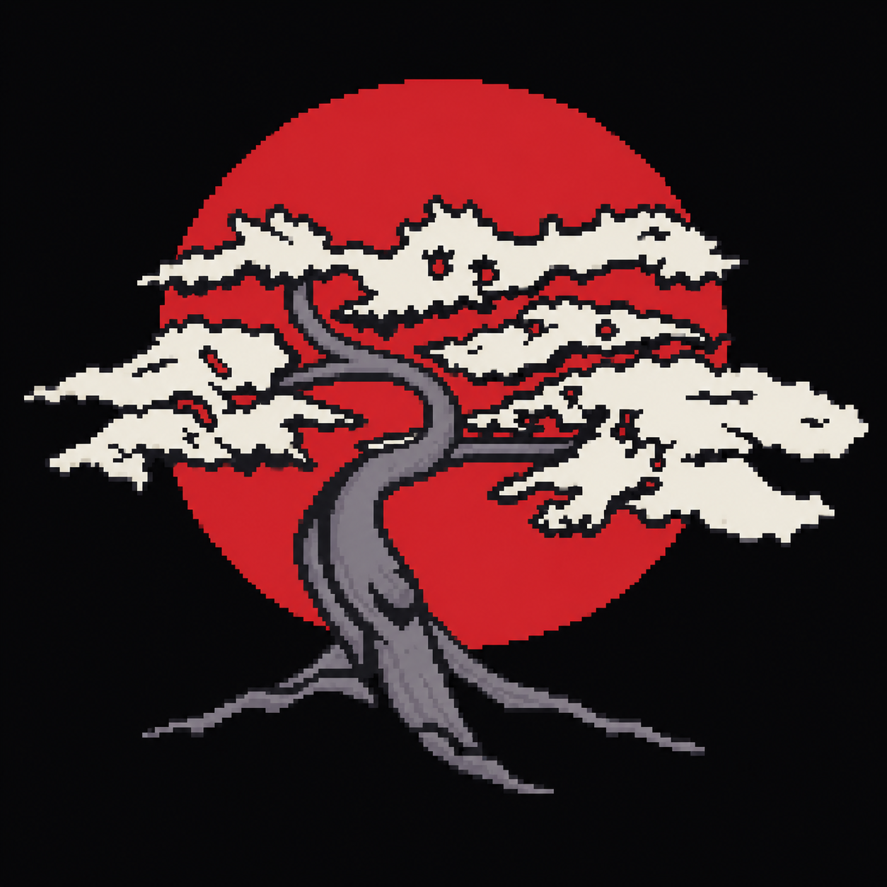
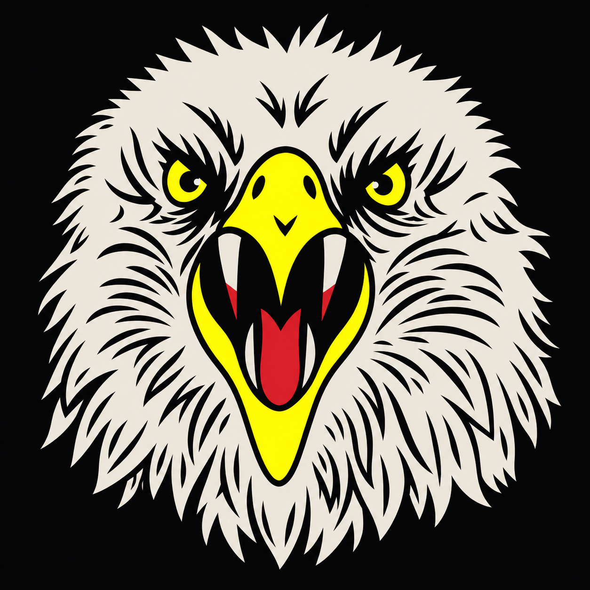
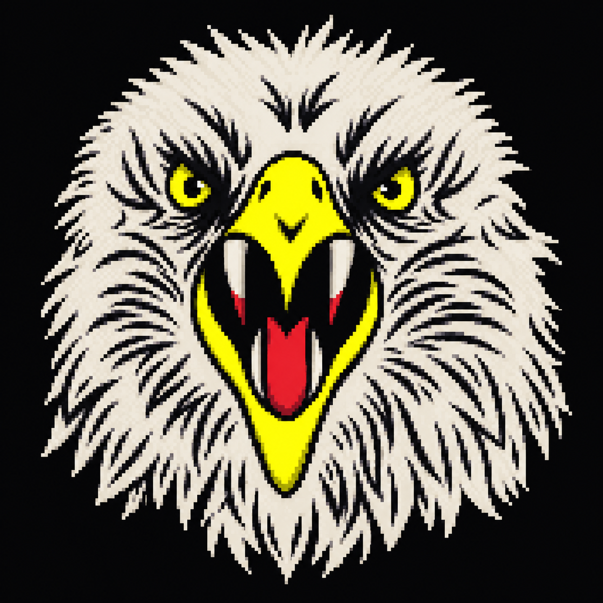

# Approved square dojo artwork — review handoff

Part of UNR-114. This revision supersedes the rejected simplified SVG crests and their proofs. Those files have been removed from the current PR.

## Approved visual direction

- `cobrakai-square.png`: original-style detailed cobra and coil; all lettering, slogan band and enclosing rings removed.
- `miyagido-square.png`: detailed bonsai and sun only; no lettering.
- `eaglefang-square.png`: detailed front-facing eagle head only; no banner or lettering.

These are the exact three generated square PNGs approved in the conversation, supplied unchanged for Claude to review. Preserve the recognisable original artwork, organic detail and text-free compositions. Do not use the earlier geometric redraws.

## Palette intent

Near-black #09090b background; electric yellow #ffff00; game red #d3262f; bone #ece6da; muted grey #7b7480. Cobra uses yellow/red, Miyagi-Do uses a red sun with bone foliage and grey trunk, Eagle Fang uses bone/yellow/red. Reuse of yellow and red inside dojo artwork was explicitly raised before the user accepted this direction. Generated PNGs have antialiasing and colour variation; exact palette compliance is not yet verified.

## Production work outstanding

These are raster visual references, NOT production SVG sources. They do not meet the original editable-SVG/no-bitmap contract or its under-20KB source budget. Do not embed them in an SVG and call that vector delivery.

Before integration: establish a faithful editable-vector treatment, enforce the exact palette, balance perceived size and padding, and check 200px plus 24px use. Separate optical reductions may still be needed at 24px. Square canvases do not by themselves guarantee safe circular cropping. No actual-size or accessibility approval is claimed for this revision.

## Higher-density pixel-art alternative — approved for review

Karin preferred this finer pixel treatment to the earlier coarse experiment and asked to add all three to this PR as an alternative for Claude. The original square artwork above remains available; no final integration choice has been made. The coarse experiment is not included.

| Dojo | Original reference | Higher-density pixel alternative |
| --- | --- | --- |
| Cobra Kai |  |  |
| Miyagi-Do |  |  |
| Eagle Fang |  |  |

The pixel PNGs are the exact generated outputs accepted in the conversation, copied without resizing, recolouring or other changes. They are visual alternatives, not production-ready SVGs. The format, palette, size and accessibility checks above remain outstanding. Compare both treatments at 200px and 24px before choosing an integration approach.

### Pixel-density setting for future artwork

- **Prompt target: approximately 160 × 160 logical pixels per square crest**, enlarged crisply; described as polished high-resolution 32-bit arcade pixel art.
- This is an image-generation prompt instruction, **not an enforced renderer setting or a verified 160 × 160 source grid**. The supplied PNGs are 1254 × 1254 output images; output resolution is not logical pixel density. Do not claim a fixed integer-scale grid from these previews.
- Use these three images as style references for future artwork: fine consistent square pixels, small stair-stepped contours, carefully placed clusters, detailed internal shapes, restrained pixel shading. Preserve recognisable silhouettes and text-free compositions.
- Keep logical pixel size consistent at the intended display size. For a 200px square crest, a true 160px logical grid would imply about 1.25 display pixels per logical pixel; runtime scaling therefore needs deliberate review. If an exact shared grid is required, create and validate native pixel sources separately.
- Prompt palette: background #09090b; yellow #ffff00; yellow shadow #7a7a00; bone #e8e2d6 / #ece6da; grey #7b7480; dark #2a2a30; red #d3262f. No additional hues. Exact output palette compliance has not been verified.

### Reusable generation prompt

Generated with the built-in image-generation tool, using each original square PNG as its reference. Replace the bracketed dojo and subject details for another asset:

> Create a HIGHER PIXEL DENSITY pixel-art version of this approved [dojo] crest for Strike First arcade game. Single square crest preview. [Preserve the subject's specific features.] Stay extremely close to reference silhouette, pose, proportions and intricate original detail. User requests finer, higher-density pixel art than the previous coarse version. Render as polished high-resolution 32-bit arcade pixel art with approximately 160x160 logical pixel resolution enlarged crisply: small consistent square pixels, fine stair-stepped contours, carefully placed clusters, detailed facial features and internal shapes, subtle restrained pixel shading. Pixel edges must still be visible, but about twice as fine as a chunky 64-80px sprite. Preserve original identity and craft. Centered with safe margins for a square profile avatar. Flat near-black #09090b background. Palette: yellow #ffff00, yellow shadow #7a7a00, bone #e8e2d6 and #ece6da, grey #7b7480, dark #2a2a30, red #d3262f. No new hues. No text, lettering, band, banner, frame, glow, smooth gradients, blur or mockup. Do not coarsen or geometrically simplify the reference. Fine precise pixel art, not smooth vector artwork. Single asset only.

Subject clauses used:

- Cobra Kai: Preserve frontal spread hood, threatening face, red forked tongue, segmented yellow belly and wide coil at bottom.
- Miyagi-Do: Preserve broad bone bonsai canopy, curved grey trunk and exposed roots, large red sun behind.
- Eagle Fang: Preserve frontal aggressive eagle head, flared bone feather outline, yellow eyes and beak, open red mouth and long bone fangs.

Only design/dojo-crests/ changes. No game edits, version bump, tag or merge. Each review update adds a commit to the existing PR, preserving history rather than force-pushing.
